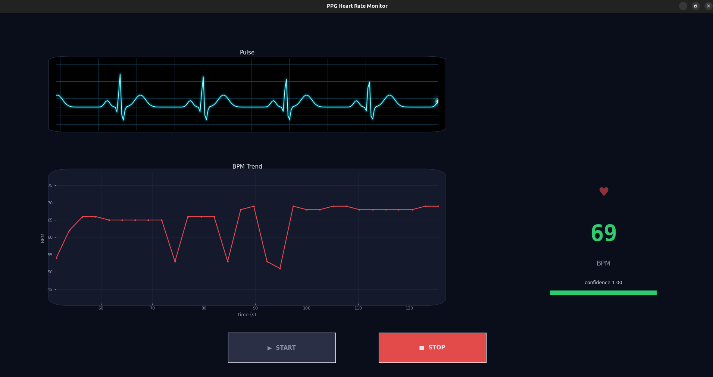
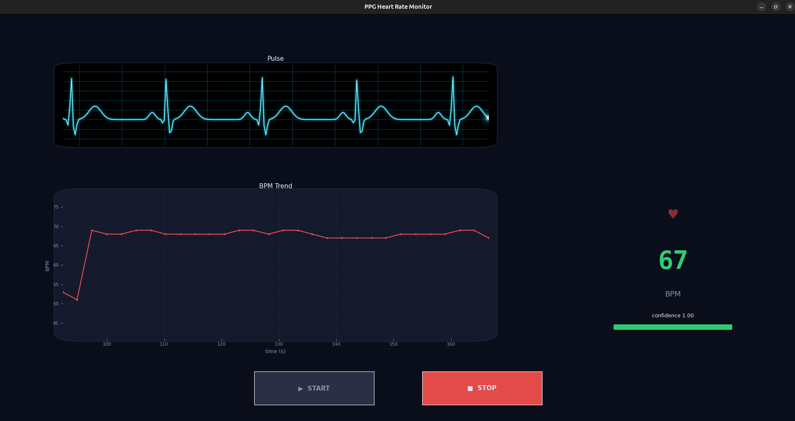
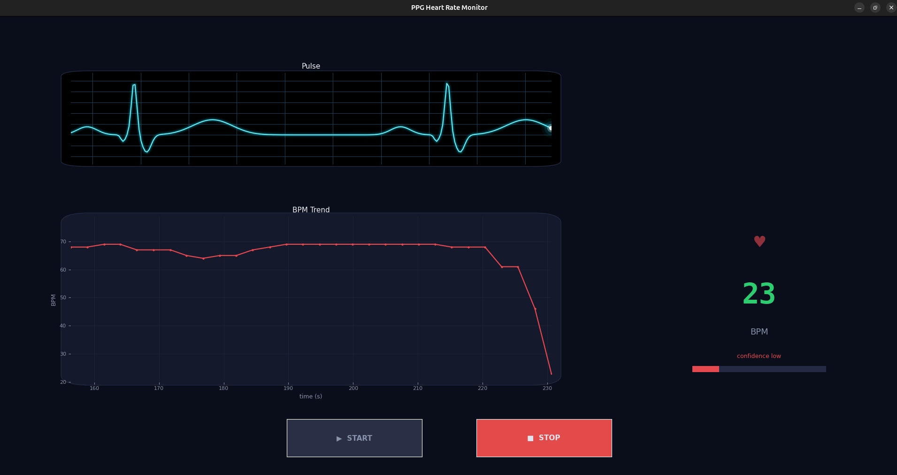

# Heart Rate Monitor

Firmware for a heart rate monitor built on the **nRF52840 DK**, using Nordic nRF Connect SDK (NCS) v3.2.0 / Zephyr RTOS 4.2.x.

The application reads photoplethysmography (PPG) data from the **XD58C** pulse sensor via ADC, filters and FFT-analyzes it on-device to estimate heart rate, and streams the resulting BPM over UART.

See [`CHANGELOG.md`](CHANGELOG.md) for what's new in each version.

## Hardware

| Component | Detail |
|-----------|--------|
| SoC | nRF52840 |
| Board | nRF52840 DK (`nrf52840dk/nrf52840`) |
| Sensor | [XD58C](https://www.keyestudio.com/products/keyestudio-xd-58c-pulse-sensor-module) (PPG / heart rate) |
| Interface | ADC (async) + UART (async TX) |
| Logging | Segger RTT (deferred mode) |

## Repository layout

```
app/            Application entry point and Kconfig/prj.conf
lib/xd58c/      XD58C driver (ADC → DC filter → UART TX)
include/lib/    Public header for the xd58c driver
tests/xd58c/    Unit tests (Zephyr ZTEST / Unity, runs on native_sim)
scripts/        Host-side tools
  ppg_monitor.py      Real-time PPG visualiser and heart rate calculator
  ppg_recordings.ods  Two-subject PPG recording dataset (columns: ac_ppg, raw_adc)
keys/           Signing keys — gitignored, not committed
boards/         Custom board definitions (if any)
dts/bindings/   Custom devicetree bindings
```

## How it works

1. `xd58c_init()` — configures the ADC channel at 200 Hz (5 ms interval), registers an async UART callback, and starts continuous ADC sampling.
2. ADC callback — each raw sample passes through a cascaded 4th-order Butterworth highpass (0.5 Hz) then a cascaded 4th-order Butterworth lowpass (4 Hz) to isolate the cardiac AC waveform, then the result is enqueued. See [Filter frequency response](#filter-frequency-response) below for details.
3. `xd58c_process()` — dequeues samples continuously; once 512 of them (~2.56 s at 200 Hz) have accumulated, it runs an FFT, picks the dominant frequency via Harmonic Product Spectrum, median-filters it over the last 5 blocks, and transmits the result as `"BPM:<value>\r\n"` over UART0.
4. `main()` calls `xd58c_init()` once, then loops on `xd58c_process()`.

## Live BPM confidence

`scripts/ppg_monitor.py` shows a **confidence** score next to the live BPM, based on how stable recent readings are relative to their own trend — not a measure of skin contact or signal quality directly. Each new reading is compared to the mean of the last 5; confidence is the fraction of the last 5 that landed within ±5 BPM of that mean. ≥0.5 shows green with the score, below that shows red "confidence low".

**Expect ~15–20 seconds** after placing a finger before confidence reliably locks onto the true rate — the FFT-based estimate needs a few ~2.56 s blocks to fill its median filter and reject initial octave-error blips. A drop back to low confidence (e.g. lifting the finger) is reported within a couple of readings.

| Locking on | Locked, steady | Signal lost |
|---|---|---|
|  |  |  |

## Filter frequency response

The ADC signal passes through a 0.5 Hz highpass (removes DC/drift) then a 4 Hz lowpass (removes high-frequency noise), each a 4th-order Butterworth (2 cascaded biquad sections). 4th order was chosen over a shallower design because the raw signal carries a persistent ~20 Hz interference tone that a 1st/2nd-order rolloff barely touches.

See [`docs/filter-design.md`](docs/filter-design.md) for the order comparison, measured attenuation data, and an interactive Bode plot.

## Prerequisites

- [Docker](https://docs.docker.com/get-docker/) — all build tooling is in the provided `Dockerfile`
- [west](https://docs.zephyrproject.org/latest/develop/west/index.html) — Zephyr meta-tool (installed inside the Docker image)

## Local development setup

Pull the pre-built image (one-time):

```bash
docker pull vinaydivakar/heart-rate-build-env:latest
```

Start a shell inside the container, mounting the workspace:

```bash
docker run --rm -it \
  -v /path/to/heart-rate-workspace:/workdir \
  vinaydivakar/heart-rate-build-env:latest
```

Inside the container, initialize the west workspace (one-time):

```bash
cd /workdir/heart-rate-monitor
west init -l .
west update --narrow
```

## Building

```bash
west build -p always \
  -b nrf52840dk/nrf52840 \
  --sysbuild \
  app \
  -- \
  -DSB_CONFIG_BOOT_SIGNATURE_KEY_FILE="/workdir/heart-rate-monitor/keys/heart-rate-ec-p256-dev.pem"
```

- `--sysbuild` builds MCUboot + the application together.
- The signing key path overrides the hardcoded path in `app/sysbuild.conf`.
- Compiled output lands in `build/`.

### Treat warnings as errors (recommended)

Add `-Dapp_CONFIG_COMPILER_WARNINGS_AS_ERRORS=y` to the build command. This is scoped to the app domain only and does not affect MCUboot.

## Flashing

```bash
west flash
```

## Unit tests

Tests live in `tests/xd58c/` and run on the `native_sim` platform — no hardware required.

```bash
west twister \
  -T tests/ \
  --platform native_sim \
  --inline-logs \
  --outdir twister-out/
```

Test results are written to `twister-out/twister.xml` (JUnit format).

### What is tested

| Area | Covers |
|------|--------|
| `xd58c_init()` | Happy path, and each failure mode (`-ENODEV` for UART/ADC not ready, `-EINVAL` for ADC channel setup) |
| `_median_of()` | Unsorted/pre-sorted/all-equal inputs, and rejecting a single octave-error outlier |
| `_parabolic_interpolate()` | Symmetric and skewed peaks, flat-top (no offset), and both bin-range edges (no interpolation) |
| `_hps_peak_bin()` | Picks the correct dominant bin from a synthetic spectrum; all-zero spectrum default |
| Full pipeline | `xd58c_process()` run on its own thread, fed a synthetic tone, verified end-to-end against the `"BPM:%u\r\n"` UART output |

## CI

GitHub Actions runs on every pull request and push to `main`.

| Job | Runs when | What it does |
|-----|-----------|--------------|
| `changes` | Every push and pull request | Detects whether the `Dockerfile` changed |
| `docker` | `Dockerfile` changed | Builds and pushes the build-env image to Docker Hub |
| `build-and-test` | Always (after `docker` succeeds or is skipped) | Runs inside the build-env container: initializes the west workspace (cached), builds firmware with warnings-as-errors, runs Twister unit tests, uploads `artifacts/` |

The signing key (`MCUBOOT_SIGNING_KEY_PEM`) must be set as a GitHub repository secret.

## Signing keys

Development keys live in `keys/` (gitignored). Generate a new EC P-256 key pair:

```bash
python3 $ZEPHYR_BASE/../bootloader/mcuboot/scripts/imgtool.py keygen \
  -k keys/heart-rate-ec-p256-dev.pem \
  -t ecdsa-p256
```

## License

Apache-2.0
