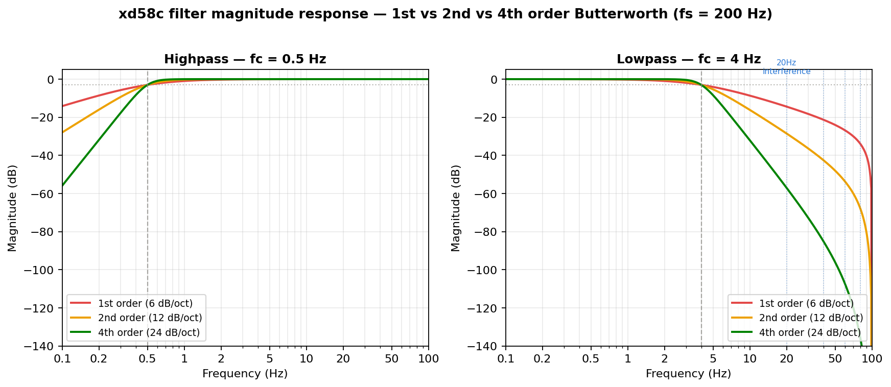
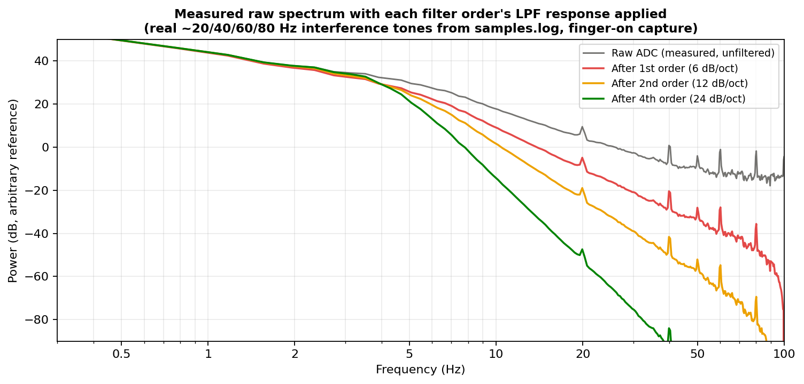

# Filter frequency response

`lib/xd58c/xd58c.c` filters every ADC sample through two cascaded biquad filters before it reaches the application:

- **`_hpf_0_5Hz`** — 0.5 Hz highpass, removes DC baseline / slow drift.
- **`_lpf_4Hz`** — 4 Hz lowpass, removes high-frequency noise above the cardiac band.

Together they pass roughly **30–240 BPM** (0.5–4 Hz) with margin around the target 40–230 BPM measurement range.

Both filters are implemented as **2 cascaded biquad sections** (4th-order Butterworth), which was chosen over a single biquad (2nd-order) or a single-pole design (1st-order) specifically for its steeper rolloff — each added order doubles the attenuation slope past the cutoff, at the cost of some added filter state/compute (negligible on the nRF52840) and a slightly slower step response.

| Order | Rolloff | HPF/LPF sections | Notes |
|-------|---------|-------------------|-------|
| 1st | 6 dB/octave | single-pole | Fastest to settle, weakest noise rejection — the old DC-tracking approach was roughly equivalent to this |
| 2nd | 12 dB/octave | 1 biquad | Previous implementation |
| **4th (current)** | **24 dB/octave** | **2 cascaded biquads** | Current implementation |

## Why 4th order

The sensor's raw ADC signal carries a persistent interference tone around **20 Hz** (plus harmonics at 40/60/80 Hz) — likely PWM, mechanical vibration, or a switching artifact — that sits well outside the 0.5–4 Hz cardiac band but close enough that a shallow rolloff barely touches it. Applying each candidate filter order's theoretical lowpass response to a real captured raw spectrum (`samples.log`, finger-on capture) shows the difference concretely:

Measured attenuation at the interference tone and its harmonics, applying each order's 4 Hz lowpass to the same captured raw spectrum:

| Tone | Raw (dB) | After 1st order | After 2nd order | After 4th order (current) |
|------|---------:|-----------------:|-----------------:|---------------------------:|
| 20 Hz (interference) | 9.49 | -4.89 | -18.96 | **-47.40** |
| 40 Hz (2nd harmonic) | 0.79 | -20.45 | -41.62 | **-84.03** |
| 60 Hz (3rd harmonic) | -1.07 | -27.93 | -54.76 | **-108.45** |
| 80 Hz (4th harmonic) | -1.79 | -35.62 | -69.44 | **-137.09** |

This was verified against real hardware captures, not just the analytic model — see the interactive Bode plot / measured PSD below for the live comparison.

**Interactive Bode plot + measured spectrum:** [xd58c Filter Frequency Response](https://claude.ai/code/artifact/59b802e4-a292-4a3a-9cb1-cb7f7538e935) — hover for exact dB values at any frequency, toggle table view, and compare the analytic 4th-order response against a Welch PSD of an actual `samples.log` capture.
